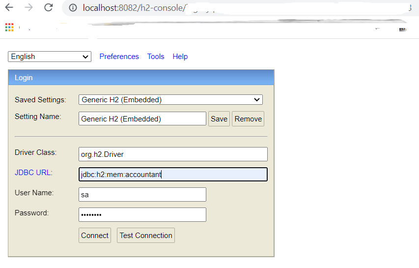
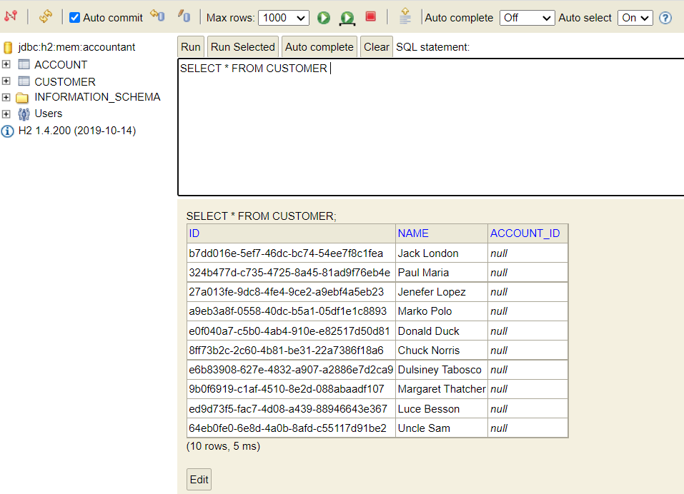
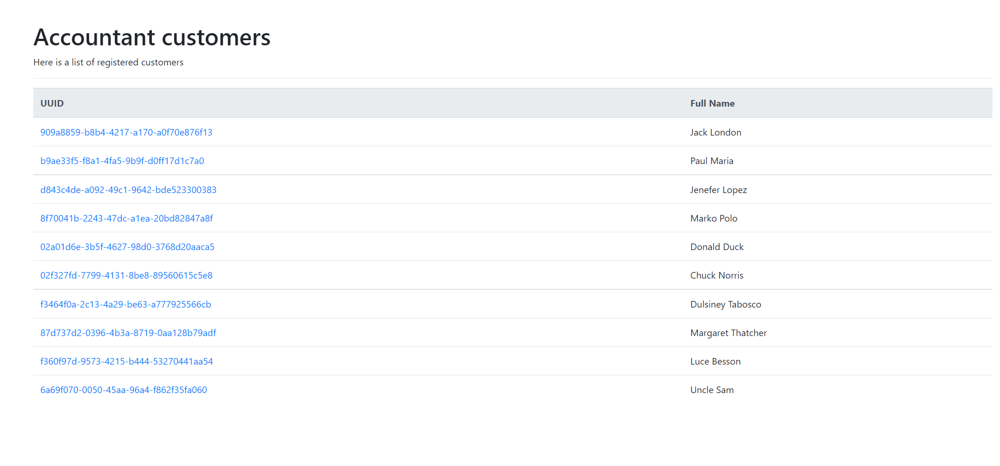
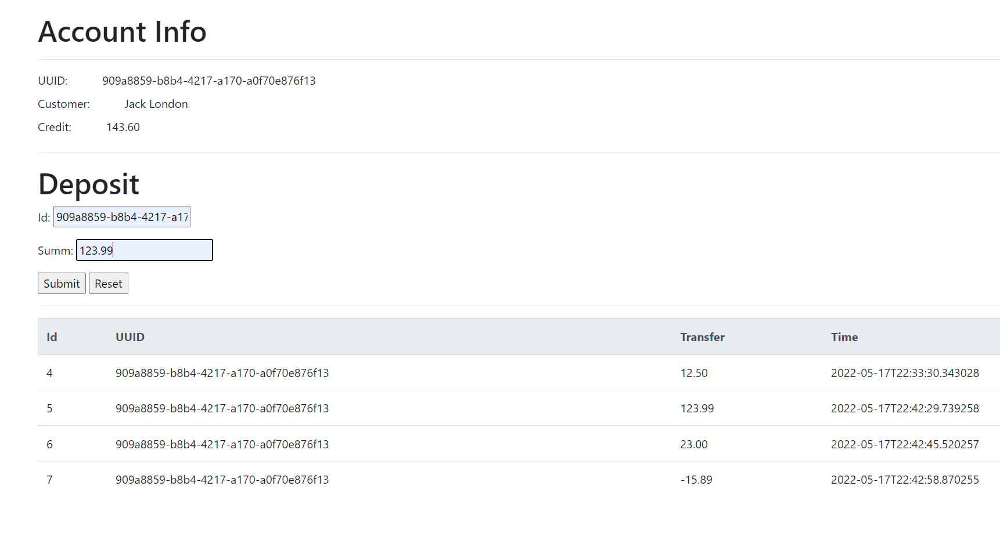

# Accountant - demo homework project

This is a small project demonstrating using spring boot REST services that mimic the work with some financial money account.  
For the sake of simplicity it is organized in the maven multi module project, where each module represents a service. This is usually not the best approach, it is better to have service as independent project.

#### Services:
* Accounts
* Transactions

#### Technical details

Project is built using **Java 11** and **maven** of version 3.6.3  
By default it tries to use 8082 and 8084 ports  
Major settings are placed into properties files:
  
`/accounts/src/main/resources/application.properties`
`/transactions/src/main/resources/application.properties`

There you may want to change servers ports:

`# Port`  
`server.port=8082`  

Also if you change the port for *transactions* you must change the *url* in *accounts*:  

`#Integration with transactions service`  
`transactions.url=http://localhost:8084/api/transactions`

Services are using h2 in memory databases. Data is not persisted between the applications restart. **Accounts** service populates the customers table on start. It is possible to access h2 console:  

######accounts:
`http://localhost:8082/h2-console`  
connection string: `jdbc:h2:mem:accountant`  

######transactions:
`http://localhost:8084/h2-console`  
connection string: `jdbc:h2:mem:transactions`  

Username: **sa**  
Password: **password**  
----------------------------------

------------------------------
Accountant customers:  

---------------------------------

#### Build and run  
You need java 11 and maven installed.  
To build project run from the root of the project 
 
`$ mvn clean install`  

It will run unit tests and create build artifacts.  
In order to start the services you need to change directory to the appropriate module (accounts, transactions) and open separate console  

###### Accounts
`$ cd accounts`  
`$ mvn spring-boot:run`  

###### Transactions  
`$ cd transactions`  
`$ mvn spring-boot:run`  

###### Test functionality  
For checking up the REST api of the services you can use [SoapUI](https://www.soapui.org/), [Postman](https://www.postman.com/) or simple [curl](https://curl.se/)  
It's better to run both services before testing. Also you may want to turn of transactions service to see error messages on operations with transactions

Here are the examples of curl commands:
1. Get list of customers  
`curl --location --request GET 'http://localhost:8082/api/accounts' \`  
`--header 'Content-Type: application/json' \`  
`--data-raw '{`  
`    "id": 12,`  
`    "credit": 10.12`  
`}'`    
2. Open new account:  
`curl --location --request POST 'http://localhost:8082/api/accounts' \`  
`--header 'Content-Type: application/json' \`  
`--data-raw '{`  
`    "id": "b7dd016e-5ef7-46dc-bc74-54ee7f8c1fea",`  
`    "credit": 10.12`  
`}'`  
3. Update account:
`curl --location --request PUT 'http://localhost:8082/api/accounts' \`  
`--header 'Content-Type: application/json' \`  
`--data-raw '{`  
`    "id": "b7dd016e-5ef7-46dc-bc74-54ee7f8c1fea",`  
`    "credit": -11.12`  
`}'`  
4. Get account info:
`curl --location --request GET 'http://localhost:8082/api/accounts/b7dd016e-5ef7-46dc-bc74-54ee7f8c1fea' \`  
`--header 'Content-Type: application/json' \  `
`--data-raw '{`  
`    "id": 12,`  
`    "credit": 10.12`  
`}'`  

##### Web UI

The raw draft UI is available by links:  
1.http://localhost:8082/ui/customers   - the main page with customers list  
2.http://localhost:8082/ui/accounts/{customer id} - the information on customers account is available from the main page

No proper validation and error handling is currently implemented.

-----------------------

-----------------------

